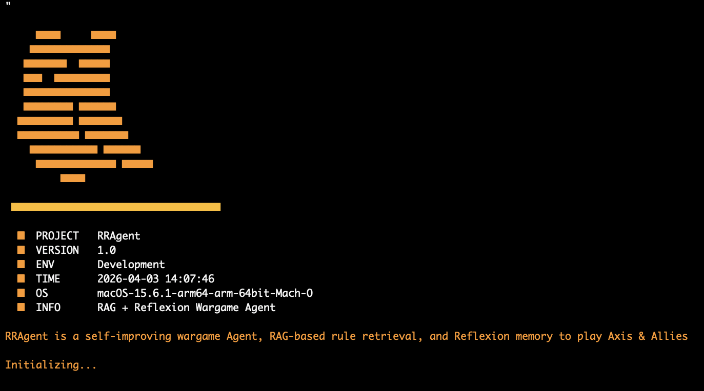

# PyBanner — Usage Guide

A standalone terminal animation module for Python projects.
No external dependencies required.

*Banner animation running in terminal*
---

## Requirements

- Python 3.9 – 3.13 (not compatible with 3.14+)
- A terminal that supports ANSI color codes (macOS Terminal, iTerm2, Linux, Windows Terminal)

---

## Setup

No installation needed. Just place `banner.py` in your project directory and import it.
```bash
# Clone or copy banner.py into your project
# Then navigate to the directory containing banner.py
cd your-project/src
```

---

## Quick Start

Run any effect directly from the terminal without writing any code:
```bash
# Banner logo effects
python -c "from banner import banner; banner(0)"   # noise reveal █
python -c "from banner import banner; banner(1)"   # diamond ◆ fade-in
python -c "from banner import banner; banner(2)"   # classic asterisk *
python -c "from banner import banner; banner(3)"   # noise reveal ◆
python -c "from banner import banner; banner(4)"   # gradient █ dark→bright
python -c "from banner import banner; banner(5)"   # gradient ◆ dark→bright

# Program info block
python -c "from banner import info; info(0)"       # █ style info
python -c "from banner import info; info(1)"       # ◆ style info

# Decorative transitions
python -c "from banner import other; other(0)"     # bar expand █
python -c "from banner import other; other(1)"     # title noise reveal
python -c "from banner import other; other(2)"     # bar expand ◆
```

---

## Import and Use in Your Code
```python
from banner import banner, info, other

# Show logo
banner(0)

# Show transition
other(1, title="RRAgent")

# Show program info
info(0,
    project="RRAgent",
    version="1.0",
    environment="Development",
    extra="RAG + Reflexion Wargame Agent"
)
```

---

## Function Reference

### `banner(para)`

Displays an ASCII logo with animation.

| para | Effect | Character |
|------|--------|-----------|
| 0 | Noise reveal | █ |
| 1 | Fade-in | ◆ |
| 2 | Classic | * |
| 3 | Noise reveal | ◆ |
| 4 | Color gradient dark→bright | █ |
| 5 | Color gradient dark→bright | ◆ |

---

### `info(para, **kwargs)`

Displays a program info block followed by a typewriter description.

| para | Style |
|------|-------|
| 0 | █ icon |
| 1 | ◆ icon |

Optional keyword arguments:

| Argument | Default | Description |
|----------|---------|-------------|
| `project` | `"RRAgent"` | Project name |
| `version` | `"1.0"` | Version string |
| `environment` | `"Development"` | Environment label |
| `extra` | `"RAG + Reflexion Wargame Agent"` | One-line description |
| `description` | built-in | Typewriter text shown after the info block |

---

### `other(para, **kwargs)`

Displays a decorative transition animation.

| para | Effect |
|------|--------|
| 0 | Horizontal bar expands from center (█) |
| 1 | Title text emerges from noise characters |
| 2 | Horizontal bar expands from center (◆) |

Optional keyword arguments:

| Argument | Default | Used by |
|----------|---------|---------|
| `title` | `"RRAgent"` | para=1 |
| `width` | `36` | para=0, 2 |

---

## Recommended Startup Sequence
```python
from banner import banner, info, other

banner(4)                    # gradient logo
other(0)                     # bar transition
info(0,
    project="RRAgent",
    version="1.0",
    environment="Dev",
    extra="RAG + Reflexion Wargame Agent"
)
```

---

## Troubleshooting

**Colors not showing / strange characters printed**
Your terminal does not support ANSI codes. Switch to macOS Terminal, iTerm2, or Windows Terminal.

**ModuleNotFoundError: No module named 'banner'**
You are not in the directory containing `banner.py`. Run:
```bash
cd path/to/directory/containing/banner.py
```

**Incompatible with Python 3.14**
This module uses libraries that require Python 3.13 or below. Create a virtual environment with Python 3.11:
```bash
python3.11 -m venv .venv
source .venv/bin/activate
```
