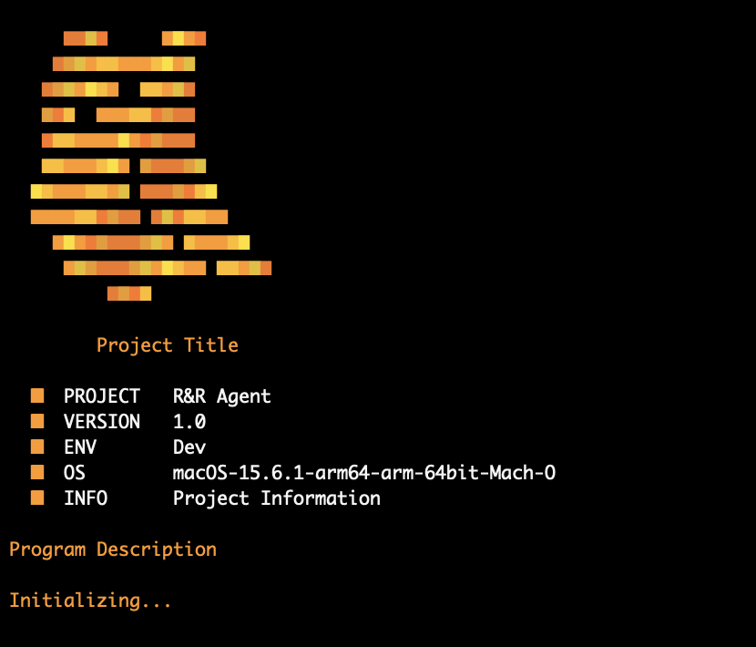
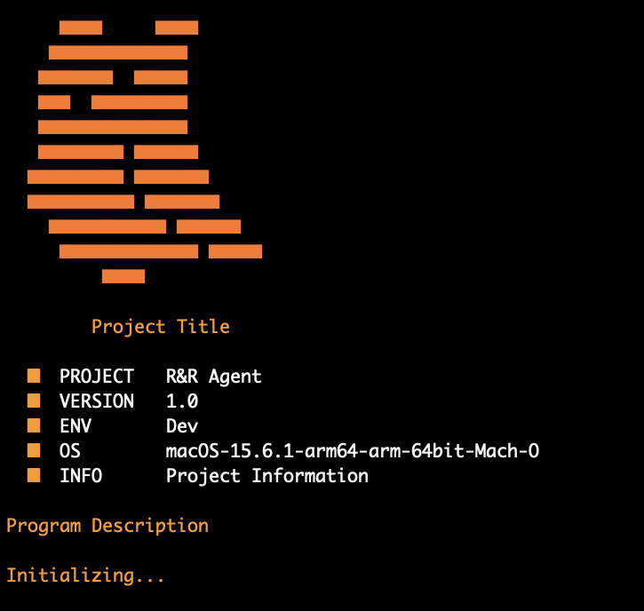

# PyBanner


A lightweight Python module for animated terminal banners. No external dependencies required.

   
---

## Installation
```bash
pip install git+https://github.com/Michaelliu1017/PyBanner.git
```

Or clone and install locally:
```bash
git clone https://github.com/Michaelliu1017/PyBanner.git
cd PyBanner
pip install -e .
```

---

## Quick Start
```python
from banner import banner, info, effect

banner(8)                          # animated wave logo
effect(1, title="MyProject")       # title emerges from noise
info(0,
    project="MyProject",
    version="1.0",
    environment="Production",
    extra="My project description",
    description="A one-line description of your project.",
    status="Initializing... All systems nominal."
)
```

---

## `banner(para)` — Logo Animation

| para | Effect | Character | Color |
|------|--------|-----------|-------|
| 0 | Noise reveal | █ | Orange |
| 1 | Fade-in row by row | ◆ | Orange |
| 2 | Classic print | * | White |
| 3 | Noise reveal | ◆ | Orange |
| 4 | Gradient dark → bright | █ | Orange |
| 5 | Gradient dark → bright | ◆ | Orange |
| 6 | Reveal top → bottom | █ | Orange |
| 7 | Scan line effect | █ | Orange + yellow |
| 8 | Wave ripple | █ | Orange palette |
| 9 | Wave ripple | █ | Grey palette |

---

## `info(para, **kwargs)` — Program Info Block

Prints a structured info block followed by two typewriter lines.

| Argument | Default | Description |
|----------|---------|-------------|
| `project` | `"Project XX"` | Project name |
| `version` | `"1.0"` | Version string |
| `environment` | `"Development"` | Environment label |
| `extra` | `"Project Information"` | One-line tag |
| `description` | `"Program Description"` | First typewriter line |
| `status` | `"Initializing..."` | Second typewriter line |
```python
info(0,
    project="RRAgent",
    version="1.0",
    environment="Dev",
    extra="RAG + Reflexion Wargame Agent",
    description="A self-improving wargame AI.",
    status="Initializing... All systems nominal. Awaiting connection."
)
```

---

## `effect(para, **kwargs)` — Decorative Transitions

| para | Effect | Keyword Args |
|------|--------|--------------|
| 0 | Bar expands from center (█) | `width=36` |
| 1 | Title emerges from noise | `title="RRAgent"` |
| 2 | Bar expands from center (◆) | `width=36` |
```python
effect(0)                    # bar expand
effect(1, title="RRAgent")  # noise title reveal
effect(2, width=50)         # wider bar expand
```

---

## Requirements

- Python 3.9 – 3.13 *(not compatible with 3.14+)*
- Terminal with ANSI color support (macOS Terminal, iTerm2, Linux, Windows Terminal)

---

## License

GPL-3.0
